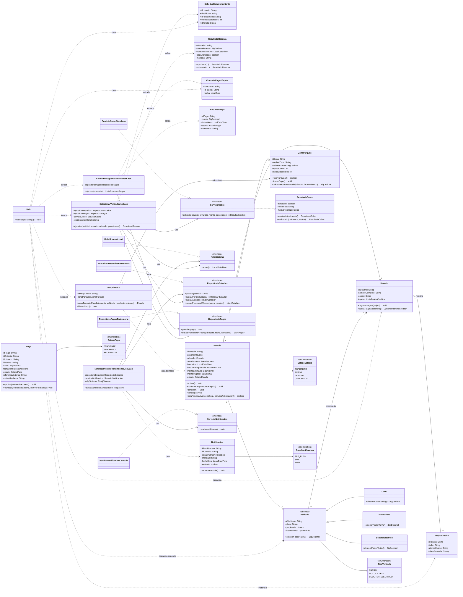

# Diagrama de Clases UML - ePark

## 1. Objetivo

Este documento presenta una vista UML del sistema ePark, enfocada en:

- estructura por capas,
- dependencias de inversion (puertos),
- entidades de dominio y sus relaciones,
- variaciones por tipo de vehiculo,
- contratos de aplicacion para los 3 casos de uso.

## 2. Alcance modelado

El diagrama incluye los componentes con mayor peso arquitectonico:

- Capa app: `Main`.
- Capa application: DTO y casos de uso.
- Capa domain: entidades, enums y puertos.
- Capa infrastructure: implementaciones stub en memoria/consola.

## 3. Diagrama UML (Mermaid)

## 4. Lectura academica del modelo

### 4.1 Separacion de responsabilidades

- `application` coordina casos de uso y traduce entradas/salidas con DTO.
- `domain` concentra reglas de negocio y estados.
- `infrastructure` materializa puertos mediante stubs reemplazables.
- `app.Main` actua como adaptador de interfaz de consola y persistencia TXT.

### 4.2 Inversion de dependencias

Los casos de uso dependen de interfaces (`RepositorioEstadias`, `RepositorioPagos`, `ServicioCobro`, `ServicioNotificacion`, `RelojSistema`) y no de implementaciones concretas.

Esto habilita:

- pruebas unitarias con dobles,
- sustitucion de infraestructura sin afectar dominio,
- evolucion hacia DB o pasarela real sin reescribir casos de uso.

### 4.3 Reglas de negocio visibles en el diagrama

- `Estadia` controla transiciones de estado (`BORRADOR -> ACTIVA`, cancelacion, vencimiento).
- `Parquimetro` delega calculo tarifario a `ZonaParqueo` y controla cupos.
- `Vehiculo` aplica polimorfismo para factor tarifario por tipo.
- `Pago` encapsula resultado transaccional (aprobado/rechazado) y trazabilidad externa.

### 4.4 Puntos de extension recomendados

- Agregar repositorios persistentes (SQL/NoSQL) implementando puertos actuales.
- Incorporar estrategias de precio dinamico en `ZonaParqueo`.
- Separar autenticacion/registro de `Main` en un caso de uso dedicado.
- Integrar `NotificarProximoVencimientoUseCase` a un scheduler real.
