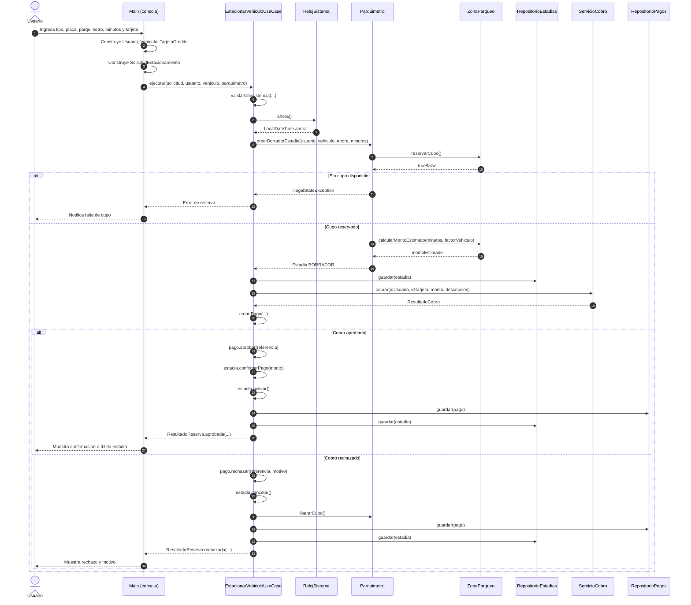
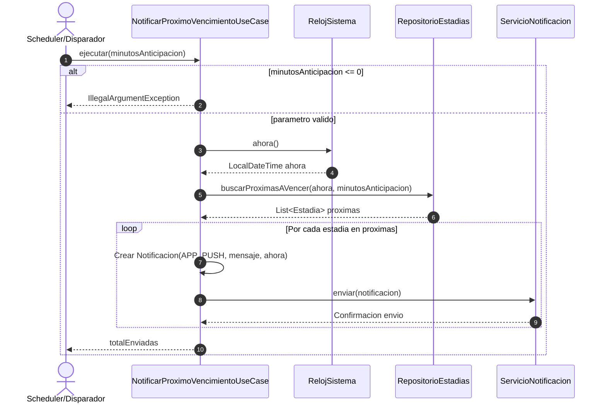
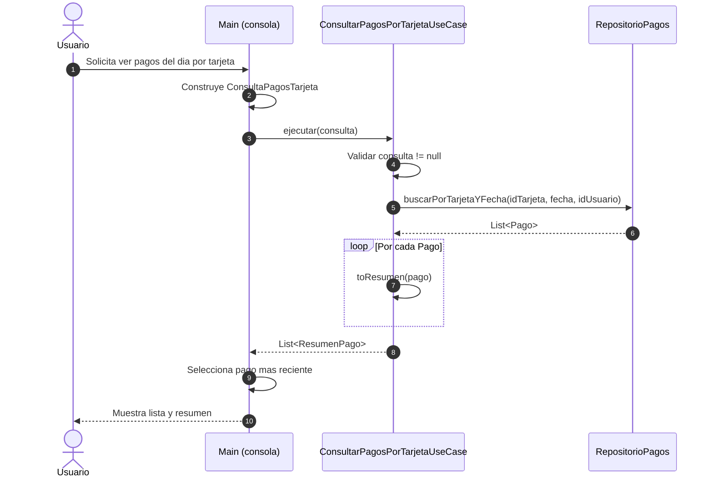

# Diagramas de Secuencia - Historias de Usuario ePark

## 1. Introduccion

Este documento modela el comportamiento dinamico de las tres historias de usuario del alcance actual:

- HU 7.1 Estacionar vehiculo en calle.
- HU 7.2 Notificar proximidad de vencimiento.
- HU 7.3 Consultar pagos por tarjeta en un dia.

Cada secuencia esta alineada con los mensajes reales observables en los casos de uso y en el flujo de consola.

---

## 2. HU 7.1 - Estacionar vehiculo en calle

### 2.1 Intencion funcional

Permitir que un usuario con sesion activa reserve parqueo, procese el cobro y obtenga resultado de reserva aprobado o rechazado.

### 2.2 Precondiciones

- Usuario autenticado en consola.
- Vehiculo seleccionado y valido.
- Parquimetro existente.
- Minutos de reserva mayores a cero.

### 2.3 Diagrama de secuencia

### 2.4 Postcondiciones

- Existe registro de `Pago` en repositorio (aprobado o rechazado).
- Existe registro de `Estadia` persistido con estado consistente.
- Se libera cupo solo en ruta de rechazo.

### 2.5 Riesgos y controles

- Riesgo: inconsistencia entre monto estimado y monto cobrado.
- Control: el caso de uso utiliza `estadia.getMontoEstimado()` como fuente para cobro y confirmacion.
- Riesgo: reserva sin cupo.
- Control: `ZonaParqueo.reservarCupo()` bloquea el flujo antes de crear una estadia activa.

---

## 3. HU 7.2 - Notificar proximidad de vencimiento

### 3.1 Intencion funcional

Detectar estadias activas cercanas al vencimiento y emitir notificaciones al usuario con una ventana de anticipacion definida.

### 3.2 Precondiciones

- `minutosAnticipacion > 0`.
- Repositorio de estadias con estado actualizado.

### 3.3 Diagrama de secuencia

### 3.4 Postcondiciones

- Se retorna el total de notificaciones enviadas.
- Cada notificacion tiene trazabilidad por `idNotificacion` y `idUsuario`.

### 3.5 Riesgos y controles

- Riesgo: notificaciones duplicadas en ejecuciones frecuentes.
- Control actual: no existe deduplicacion persistente; depende de la frecuencia del disparador.
- Riesgo: reloj no controlado en pruebas.
- Control: se usa puerto `RelojSistema`, permitiendo inyectar reloj fijo en testing.

---

## 4. HU 7.3 - Consultar pagos por tarjeta en un dia

### 4.1 Intencion funcional

Listar pagos de un usuario para una tarjeta especifica en una fecha dada, devolviendo un resumen orientado a consulta.

### 4.2 Precondiciones

- Consulta con `idUsuario`, `idTarjeta` y `fecha` validos.
- Repositorio de pagos disponible.

### 4.3 Diagrama de secuencia

### 4.4 Postcondiciones

- El resultado retorna una coleccion de `ResumenPago` desacoplada de la entidad `Pago`.
- La capa de presentacion puede ordenar y seleccionar el pago mas reciente sin alterar dominio.

### 4.5 Riesgos y controles

- Riesgo: consulta cruzada de usuarios sobre misma tarjeta.
- Control: filtro incluye `idUsuario` ademas de `idTarjeta` y fecha.
- Riesgo: sobreexposicion de datos internos de `Pago`.
- Control: transformacion a DTO `ResumenPago`.

---

## 5. Observaciones de diseno transversal

- Los tres flujos aplican orquestacion en casos de uso y conservan la logica de estado en dominio.
- El punto mas sensible de transaccion esta en HU 7.1 (reserva + cobro + persistencia), por lo que es candidato a pruebas de integracion con escenarios de falla parcial.
- HU 7.2 y HU 7.3 son buenas candidatas para pruebas unitarias puras con mocks de puertos.
